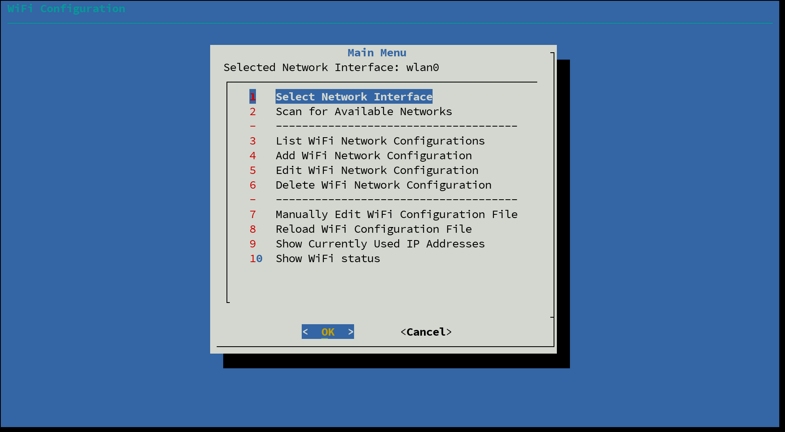
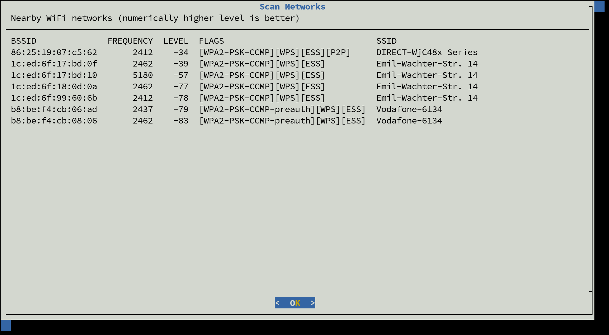
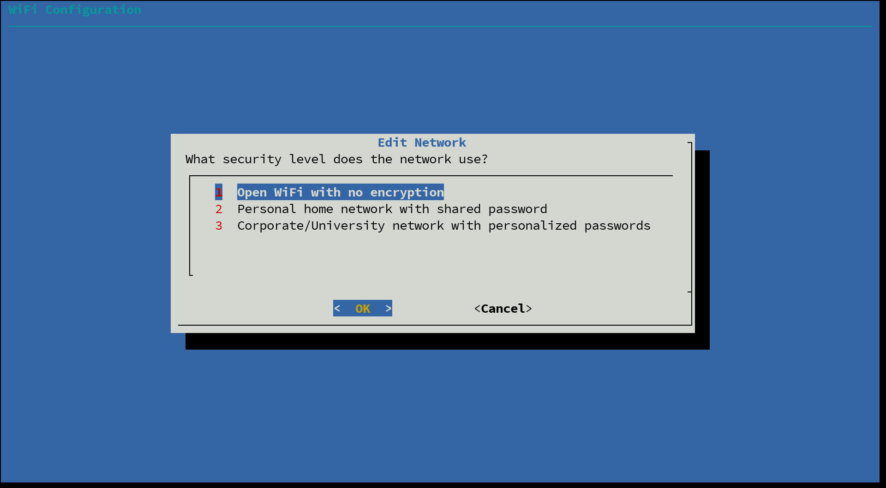

wifi-config
===========

TUI for simple WiFi configuration based on wpa_supplicant 

<p float="left">
  
  
  
</p>

This is a good old-fashioned shell script using `dialog` to create a simple menu-driven
text user-interface for WiFi configuration. It is meant to be used on small Linux systems
like on the Raspberry Pi, where no desktop environment or full-grown package like Network
Manager are available. It is a tiny frontend for `wpa_supplicant` and its `wpa_cli` command,
simplifying the most common actions:

 1. Search for available WiFi networks
 2. Add, edit or delete known WiFi networks
 3. Manually edit the `wpa_supplication` configuration
 4. Get basic information about network connectivity

I wrote this for my Internet of Things lectures at DHBW Karlsruhe (Corporate State University
Baden-Württemberg Karlsruhe), specifically because `raspi-config` doesn't handle WiFi well.
In the lectures we use Raspberry Pi OS Lite as a bare-bones Linux system but still need to be
able to connect to the University WiFi network (eduroam) using WPA Enterprise, where each
student and teacher has their own credentials.

To keep the minimal spirit, I wrote this small script to help students with the WiFi setup.
This way we don't need to install and configure Network Manager but stick with the pre-installed
`wpa_supplicant` just as on a real embedded device.

Installation
------------

With the device connected to the Internet, execute the following command:

```sh
wget -q -O - https://raw.githubusercontent.com/DennisSchulmeister/wifi-config/main/install.sh | sh
```


The script creates two files on your device:

  * `/opt/wifi-config/wifi-config`: The actual program
  * `/etc/profile.d/wifi-config.sh`: Profile script to extend the `$PATH` variable

After a re-login the program can be started with a simple `wifi-config`.

Alternatively just download the file [wifi-config](https://raw.githubusercontent.com/DennisSchulmeister/wifi-config/main/install.sh)
and make it executable with `chmod +x wifi-config`.

Uninstallation
--------------

The install script can also uninstall the program. Just confirm, that the old version shall be
removed and answer No, when it asks to continue with the installation. Alternatively simple
delete the two files mentioned above.

Help Wanted
-----------

This is just a simple script, that only handles three types of WiFi:

 * No authentication
 * WPA2 using a shared secret
 * WPA Enterprise using individual credentials

Even though it would be easily possible, currently the script doesn't detect the type of
network, when a new network is created. Instead, the user must manually select the type.
Here the script could be more smart and possibly also support more types of WiFi networks.

Join the [discussion on GitHub](https://github.com/DennisSchulmeister/wifi-config/discussions),
or [create an issue](https://github.com/DennisSchulmeister/wifi-config/issues), if you
need help or want to improve the script. Patches are most welcome :-)

Copyright
---------

wifi-config <br>
© 2023 Dennis Schulmeister-Zimolong <dennis@wpvs.de> <br>

This program is free software: you can redistribute it and/or modify
it under the terms of the GNU Affero General Public License as
published by the Free Software Foundation, either version 3 of the
License, or (at your option) any later version.